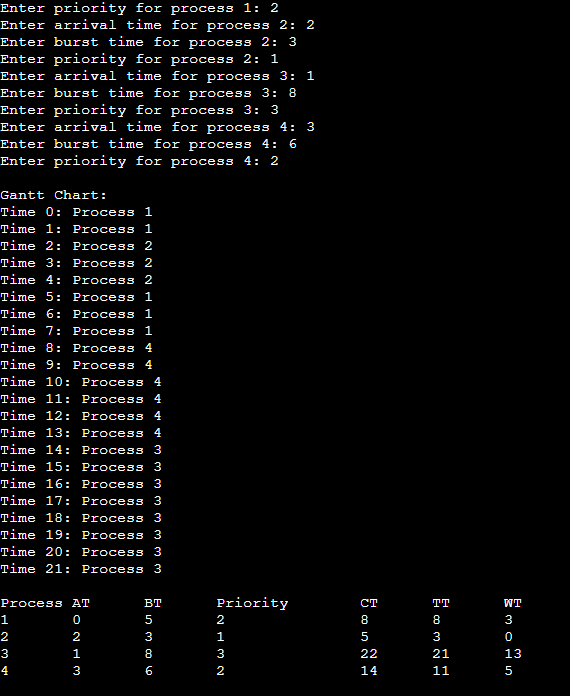
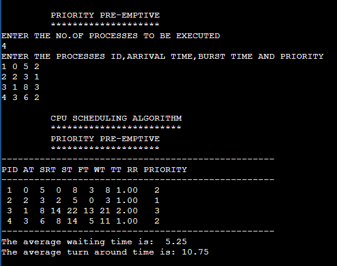

# EX.5-IMPLEMENTATION-OF-CPU-SCHEDULING-ALGORITHMS

### AIM: 
To implement First-Come-First-Serve (FCFS) Scheduling

### ALGORITHM:
1. Start with a queue (or a list) to represent the ready queue of processes.
2. Initialize a timer or clock to 0.
3. Read the number of processes (n) and create a data structure to store process information, including arrival time (AT) and burst time (BT) for each process.
4. Read the arrival time and burst time for each process and store them in the data structure.
5. Sort the processes in the ready queue based on their arrival times in ascending order. This step ensures that processes are executed in the order they arrive.
6. Initialize the waiting time (WT) and turnaround time (TAT) for the first process to 0.
7. For each process in the ready queue (in the order of arrival): a. Calculate the start time (ST) as the maximum of the current time and the arrival time of the process. b. Calculate the finish time (FT) as the start time plus the burst time of the process. c. Calculate the waiting time (WT) for the process as the start time minus the arrival time. d. Calculate the turnaround time (TAT) for the process as the finish time minus the arrival time. e. Update the current time to the finish time.
8. Calculate the average waiting time (AWT) and average turnaround time (ATAT) for all processes by summing up the individual waiting times and turnaround times and dividing by the total number of processes.
9. Display the waiting time, turnaround time, and other relevant information for each process.
10. Display the average waiting time and average turnaround time for all processes.
11. End.

### PROGRAM:
~~~
#include<stdio.h>
int main()
{
int c=0,i,n,bt[10],at[10],wt[10],ft[10];
int st[10],tat[10];
float awt=0,atat=0,rr[10];
printf("Enter the number of process : ");
scanf("%d",&n);
for(i=1;i<=n;i++)
{
printf("Enter the arrival time and burst time for the process %d",i);
scanf("%d %d",&at[i],&bt[i]);

}
for(i=1;i<=n;i++)
{
st[i]=c;
c=c+bt[i];
wt[i]=st[i]-at[i];
ft[i]=st[i]+bt[i];
tat[i]=wt[i]+bt[i];
rr[i]=tat[i]/bt[i];
}
for(i=1;i<=n;i++)
{
awt=awt+wt[i];
atat=atat+tat[i];
}
awt=awt/n;
atat=atat/n;
printf("\n\t\t CPU SCHEDULING\n\t\t ***************");
printf("\n\t\t FIRST COME FIRST SERVE\n\t\t **********************");
printf("\n--------------------------------------------------------------\n");
printf("proc\t at\t bt\t st\t ft\t wt\t tat\t rr\t\n");
printf("--------------------------------------------------------------");
for(i=1;i<=n;i++)
{
printf("\n %d\t %d\t %d\t %d\t %d\t %d\t %d\t%5.2f",i,at[i],bt[i],st[i],ft[i],wt[i],tat[i],rr[i]);
}
printf("\n--------------------------------------------------------------");
printf("\n Average waiting time is %5.2f\n average tat is%5.2f",awt,atat); }
~~~

### OUTPUT:

### RESULT: 
First-Come-First-Serve Scheduling is implemented successfully.

# Shortest Job First (SJF) Preemptive Scheduling
### AIM: 
To implement Shortest Job First (SJF) Preemptive Scheduling

### ALGORITHM:
1. Initialize variables and arrays to store process information, such as process ID (p), arrival time (at), burst time (bt), start time (st), finish time (ft), waiting time (wt), turnaround time (tt), response ratio (rr), and a flag to mark completed processes (iscompleted).

2. Read the number of processes (n) from the user.

3. Read the process ID, arrival time, and burst time for each process and store them in respective arrays (p, at, bt).

4. Initialize variables, such as nextst (next start time) and counters.

5. Loop until all processes are completed: a. Find the process with the minimum burst time among the processes that have arrived and are not completed. b. Update the start time, finish time, waiting time, and turnaround time for the selected process. c. Calculate the response ratio (rr) for the selected process (rr = turnaround time / burst time). d. Mark the selected process as completed. e. Update the nextst to the finish time of the selected process.

6 Calculate the average waiting time (AWT) and average turnaround time (ATT) by summing up the individual waiting times and turnaround times and dividing by the total number of processes.

7. Display the process information, including process ID, arrival time, burst time, start time, finish time, waiting time, turnaround time, and response ratio.

8. Display the average waiting time and average turnaround time.

### PROGRAM:
~~~
#include<stdio.h>
int main()
{
int i,n,p[10],st[10],at[10],bt[10],ft[10],wt[10],tt[10];
int nextst,count,minsrt,minpos;
static int  iscompleted[10];
float rr[10],awt=0,att=0;
printf("\n\t SHORTEST JOB FIRST\n\t ******************");
printf("\nEnter the no. of process to be executed :");
scanf("%d",&n);
printf("\nEnter the process,arrival time and burst time\n");
for(i=0;i<n;i++)
{
scanf("%d %d %d",&p[i],&at[i],&bt[i]);
}
nextst=0;
for(count=0;count<n;count++)
{
minsrt=100;
minpos=0;
for(i=0;i<n;i++)
{
if(at[i]<=nextst&&iscompleted[i]==0)
{
if(minsrt>bt[i])
{
minsrt=bt[i];
minpos=i;
}
}
}
i=minpos;
st[i]=nextst;
ft[i]=st[i]+bt[i];
wt[i]=st[i]-at[i];
tt[i]=wt[i]+bt[i];
rr[i]=tt[i]/bt[i];
iscompleted[i]=1;
nextst=ft[i];
}
printf("\n---------------------------------------");
printf("\nPRO AT bT ST FT WT TT RR \n");
printf("---------------------------------------\n");
for(i=0;i<n;i++)
{
printf("%3d %2d %2d",p[i],at[i],bt[i]);
printf(" %3d %2d %2d %2d %4.2f\n",st[i],ft[i],wt[i],tt[i],rr[i]);
}
printf("---------------------------------------");
for(i=0;i<n;i++)
{
awt=awt+wt[i];
att=att+tt[i];
}
awt=awt/n;
att=att/n;
printf("\nAverage waiting time is %5.2f",awt);
printf("\nAverage turn around time is %5.2f",att);
}
~~~

### OUTPUT:

### RESULT: 
Shortest Job First (SJF) preemptive scheduling is implemented successfully.

# Shortest Job First (SJF) Non-Preemptive Scheduling
### AIM: 
To implement Shortest Job First (SJF) Non-Preemptive Scheduling

### ALGORITHM:
1. Initialize variables and arrays to store process information, such as process ID (process_id), arrival time (arrival_time), burst time (burst_time), completion time (completion_time), waiting time (waiting_time), and turnaround time (turnaround_time).

2. Read the number of processes (n) from the user.

3. Input process information for each process, including arrival time and burst time, and store this information in the respective arrays.

4. Sort the processes based on their arrival times in ascending order using a simple bubble sort algorithm. This step ensures that processes are in the order of their arrival.

5. Initialize the current time (time) to 0.

6. Perform the scheduling loop for all processes: a. Find the process with the smallest burst time that has already arrived and is not yet completed. Initialize "shortest_job" to -1 and "shortest_time" to a large initial value. b. Iterate through the processes, checking if they have arrived and if their burst time is smaller than the current "shortest_time." If so, update "shortest_job" to the current process. c. If "shortest_job" remains -1, it means no process is available to run at this time. Increment the time by 1.

7. If a process is available (shortest_job != -1), execute the selected process. Update the completion time, waiting time, and turnaround time for this process. Mark the burst time of the completed process as -1 to indicate completion.

8. Display the scheduling information in a tabular format, including Process ID (P), Arrival Time (AT), Burst Time (BT), Completion Time (CT), Waiting Time (WT), and Turnaround Time (TAT) for each process.

### PROGRAM:
~~~
#include <stdio.h>

int main() {
    int n;
    printf("Enter the number of processes: ");
    scanf("%d", &n);

    int process_id[10];
    int arrival_time[10];
    int burst_time[10];
    int completion_time[10];
    int waiting_time[10];
    int turnaround_time[10];

    // Input process information
    for (int i = 0; i < n; i++) {
        process_id[i] = i + 1;
        printf("Enter arrival time for process %d: ", process_id[i]);
        scanf("%d", &arrival_time[i]);
        printf("Enter burst time for process %d: ", process_id[i]);
        scanf("%d", &burst_time[i]);
    }

    // Perform SJF Non-Preemptive Scheduling
    for (int i = 0; i < n - 1; i++) {
        for (int j = 0; j < n - i - 1; j++) {
            if (arrival_time[j] > arrival_time[j + 1]) {
                // Swap arrival_time
                int temp = arrival_time[j];
                arrival_time[j] = arrival_time[j + 1];
                arrival_time[j + 1] = temp;

                // Swap burst_time
                temp = burst_time[j];
                burst_time[j] = burst_time[j + 1];
                burst_time[j + 1] = temp;

                // Swap process_id
                temp = process_id[j];
                process_id[j] = process_id[j + 1];
                process_id[j + 1] = temp;
            }
        }
    }

    int time = 0; // Current time

    for (int i = 0; i < n; i++) {
        // Find the process with the smallest burst time that has arrived
        int shortest_job = -1;
        int shortest_time = 10000; // A large initial value

        for (int j = 0; j < n; j++) {
            if (arrival_time[j] <= time && burst_time[j] < shortest_time && burst_time[j] != -1) {
                shortest_job = j;
                shortest_time = burst_time[j];
            }
        }

        if (shortest_job == -1) {
            // No process is available to run at this time
            time++;
        } else {
            // Execute the selected process
            completion_time[shortest_job] = time + burst_time[shortest_job];
            waiting_time[shortest_job] = completion_time[shortest_job] - arrival_time[shortest_job] - burst_time[shortest_job];
            turnaround_time[shortest_job] = waiting_time[shortest_job] + burst_time[shortest_job];
            time = completion_time[shortest_job];
            burst_time[shortest_job] = -1; // Mark the process as completed
        }
    }

    // Display the scheduling information
    printf("\n-----------------------------------\n");
    printf("Process\tAT\tBT\tCT\tWT\tTAT\n");
    printf("-----------------------------------\n");
    for (int i = 0; i < n; i++) {
        printf("P%d\t%d\t%d\t%d\t%d\t%d\n", process_id[i], arrival_time[i],
               burst_time[i], completion_time[i], waiting_time[i],
               turnaround_time[i]);
    }
    printf("-----------------------------------\n");

    return 0;
}
~~~

### OUTPUT:

### RESULT: 
Shortest Job First (SJF) Non-preemptive scheduling is implemented successfully.

# Round Robin (RR) Scheduling
### AIM: 
To implement Round Robin (RR) Scheduling

### ALGORITHM:
1. Initialize variables and arrays to store process information, scheduling data, and status flags.

2. Read the number of processes (n) and the time quantum (tq) from the user.

3. Input process information for each process, including process ID (PRO), arrival time (AT), and burst time (BUT). Also, calculate the total remaining burst time (totalsrt) and create a temporary array (tempsrt) to store the initial burst times.

4. Initialize the queue (queue), front (f), rear (r), and count variables for the ready queue. Also, initialize the timer to 0.

5. Enqueue processes that arrive at time 0 into the ready queue and mark them as entered (isentered) with count increments.

6. Enter the main scheduling loop, which continues until the timer reaches the total remaining burst time (totalsrt).

7. Dequeue a process from the front of the ready queue (queue[f]) and select it for execution.

8. If the selected process is starting for the first time (isstarted is 0), record its start time (ST) and calculate its waiting time (WT).

9. Execute the process for a time quantum (tq) or until its burst time (BUT) is less than tq, whichever comes first. Update the timer accordingly.

10. If the process has completed its burst time (BUT becomes 0), record its finish time (FT), calculate its waiting time (WT), turnaround time (TT), and response ratio (RR), and mark it as completed (iscompleted).

11. Check for processes that have arrived and have not entered the ready queue (isentered is 0). Enqueue them into the ready queue with count increments.

12. If the selected process is not completed, enqueue it back into the ready queue.

13. Repeat the scheduling loop until the timer reaches totalsrt.

14. Display the scheduling results, including process ID (PRO), arrival time (AT), initial burst time (BUT), start time (ST), finish time (FT), waiting time (WT), turnaround time (TT), and response ratio (RR) for each process.

15. Calculate and display the average waiting time (AWT) and average turnaround time (ATAT) for all processes.

### PROGRAM:
~~~
#include<stdio.h>
int main()
{
int n,i,pro[10],at[10],srt[10],st[10],ft[10],wt[10],tt[10];
static int iscompleted[10],isstarted[10],isentered[10];
int queue[10],f,r,count,tq,j,timer,totalsrt,tempsrt[10];
float rr[10],awt=0,atat=0;
printf("\n\t ROUND ROBIN");
printf("\nEnter the no. of process :");
scanf("%d",&n);

printf("\nEnter the value for Time Quantum:");
scanf("%d",&tq);
printf("\nEnter the process id for n process:\n");
for(i=0;i<n;i++)
{
scanf("%d",&pro[i]);
}
printf("\nEnter the arrival time for n process :\n");
for(i=0;i<n;i++)
{
scanf("%d",&at[i]);
}
printf("\nEnter the Burst time for n process:\n");
for(i=0;i<n;i++)
{
scanf("%d",&srt[i]);
}
totalsrt=0;
for(i=0;i<n;i++)
{
totalsrt=totalsrt+srt[i];
tempsrt[i]=srt[i];
}
f=0;
r=-1;
count=0;
timer=0;
for(i=0;i<n;i++)
{
if(at[i]==0)
{
r=(r+1)%n;
queue[r]=i;
isentered[i]=1;
count=count+1;
}
}
while(timer<totalsrt)
{
j=queue[f];
f=(f+1)%n;
if(isstarted[j]==0)
{
st[j]=timer;
wt[j]=st[j]-at[j];
isstarted[j]=1;
}
if(srt[j]>=tq)

{
timer=timer+tq;
srt[j]=srt[j]-tq;
}
else
{
timer=timer+srt[j];
srt[j]=srt[j]-srt[j];
}
if(srt[j]==0)
{
ft[j]=timer;
wt[j]=wt[j]+(ft[j]-(st[j]+tempsrt[j]));
tt[j]=wt[j]+tempsrt[j];
rr[j]=(float)tt[j]/tempsrt[j];
iscompleted[j]=1;
}
for(i=0;i<n&&count<n;i++)
{
if(at[i]<=timer&&isentered[i]==0)
{
r=(r+1)%n;
queue[r]=i;
isentered[i]=1;
count=count+1;
}
}
if(iscompleted[j]==0)
{
r=(r+1)%n;
queue[r]=j;
}
}
printf("\n\t CPU SCHEDULING\n\t **************");
printf("\n\t ROUND ROBIN\n\t ***********\n");
printf("------------------------------------------- \n");
printf("PRO AT BUT ST FT WT TT RR");
printf("\n------------------------------------------- \n");
for(i=0;i<n;i++)
{
printf("%3d %2d %2d",pro[i],at[i],tempsrt[i]);
printf(" %3d %3d %2d",st[i],ft[i],wt[i]);
printf(" %3d %4.2f\n",tt[i],rr[i]);
}
printf("------------------------------------------ ");

for(i=0;i<n;i++)
{
awt=awt+wt[i];
atat=atat+tt[i];
}
awt=awt/n;
atat=atat/n;
printf("\nAvg waiting time is %5.2f ",awt );
printf("\nAvg turn around time is %5.2f",atat);
}
~~~

### OUTPUT:

### RESULT: 
Round Robin (RR) Scheduling is implemented successfully.

# Priority Preemptive Scheduling
### AIM: 
To implement Priority Preemptive Scheduling

### ALGORITHM:
1. Initialize the necessary variables and data structures, including the struct Process to represent each process.

2. Read the number of processes (n) from the user.

3. Create an array of struct Process to store information for each process.

4. Input process information for each process, including arrival time, burst time, and priority. Store this information in the struct Process array.

5. Initialize the current time (time) to 0 and the completed process count (completed) to 0.

6. Display the Gantt Chart header.

7. Enter the main scheduling loop that continues until all processes have completed execution (completed equals n).

8. Inside the loop, find the highest priority process that has arrived (arrival_time <= time) and has remaining burst time (remaining_time > 0).

9. If a process with the highest priority is found, execute it for 1 unit of time by decrementing its remaining_time and updating the Gantt Chart.

10. If the process has completed its execution (remaining_time becomes 0), increment the completed process count.

11. If no process is available to run at the current time, display a message indicating that no process is running at that time.

12. Repeat the loop until all processes are completed.

13. Display the scheduling results, including the Gantt Chart, process ID, and execution time for each process.

### PROGRAM:
~~~
#include <stdio.h>

// Structure to represent a process
struct Process {
    int id;             // Process ID
    int arrival_time;   // Arrival time
    int burst_time;     // Burst time
    int priority;       // Priority
    int remaining_time; // Remaining time
};

// Function to swap two processes
void swap(struct Process *a, struct Process *b) {
    struct Process temp = *a;
    *a = *b;
    *b = temp;
}

int main() {
    int n;
    printf("Enter the number of processes: ");
    scanf("%d", &n);

    struct Process processes[n];

    // Input process information
    for (int i = 0; i < n; i++) {
        processes[i].id = i + 1;
        printf("Enter arrival time for process %d: ", processes[i].id);
        scanf("%d", &processes[i].arrival_time);
        printf("Enter burst time for process %d: ", processes[i].id);
        scanf("%d", &processes[i].burst_time);
        printf("Enter priority for process %d: ", processes[i].id);
        scanf("%d", &processes[i].priority);
        processes[i].remaining_time = processes[i].burst_time;
    }

    int time = 0; // Current time
    int completed = 0; // Number of completed processes

    printf("\nGantt Chart:\n");

    while (completed < n) {
        int highest_priority = -1;
        int highest_priority_job = -1;

        for (int i = 0; i < n; i++) {
            if (processes[i].arrival_time <= time && processes[i].remaining_time > 0 &&
                (highest_priority == -1 || processes[i].priority < highest_priority)) {
                highest_priority = processes[i].priority;
                highest_priority_job = i;
            }
        }

        if (highest_priority_job == -1) {
            // No process is available to run at this time
            printf("Time %d: No process\n", time);
            time++;
        } else {
            // Execute the highest priority process for 1 unit of time
            processes[highest_priority_job].remaining_time--;
            printf("Time %d: Process %d\n", time, processes[highest_priority_job].id);
            time++;

            // If the process has completed its execution
            if (processes[highest_priority_job].remaining_time == 0) {
                completed++;
            }
        }
    }

    return 0;
}
~~~

### OUTPUT:

### RESULT: 
Priority Preemptive scheduling is implemented successfully.

# Priority Non-Preemptive Scheduling
### AIM: 
To implement Priority Non-Preemptive Scheduling

### ALGORITHM:
1. Initialize variables and arrays to store process information, scheduling data, and status flags.

2. Input the number of processes and their details, including process ID (PID), arrival time (AT), burst time (SRT), and priority.

3. Calculate the total remaining burst time (totalsrt) by summing up the burst times of all processes and create a temporary array (tempsrt) to store the initial burst times.

4. Initialize the timer to 0.

5. Enter the main scheduling loop, which continues until all processes have completed execution (i.e., completed variable reaches n).

6. Within the loop, find the process with the highest priority that has arrived and not yet completed and has the lowest priority (higher priority value).

7. If a process is found, update its start time (ST) and calculate waiting time (WT) if it's starting for the first time (isstarted[i] is 0).

8. Reduce the remaining burst time (SRT) of the selected process by 1, indicating the execution of one time unit.

9. Increment the timer by 1.

10. If the selected process has completed its execution (SRT becomes 0), update its finish time (FT), waiting time (WT), turnaround time (TT), response ratio (RR), and set the process as completed (iscompleted[i] is 1).

11. Continue this loop until all processes are completed.

12. After scheduling all processes, display the scheduling results in a tabular format, including PID, AT, SRT, ST, FT, WT, TT, RR, and priority for each process.

13. Calculate and display the average waiting time (AWT) and average turnaround time (ATAT) for all processes.

### PROGRAM:
~~~
#include<stdio.h>
int main()
{
int i,n,pid[10],at[10],srt[10],st[10],ft[10],wt[10],tt[10],pri[10];
int timer,totalsrt,tempsrt[10],minsrt,minpos; static int iscompleted[10],isstarted[10];
float rr[10],awt,atat;
printf("\n\t PRIORITY PRE-EMPTIVE\n\t ********************");
printf("\nENTER THE NO.OF PROCESSES TO BE EXECUTED\n");
scanf("%d",&n);
printf("ENTER THE PROCESSES ID,ARRIVAL TIME,BURST TIME AND PRIORITY \n");
for(i=0;i<n;i++)
scanf("%d %d %d %d",&pid[i],&at[i],&srt[i],&pri[i]);

totalsrt=0;
for(i=0;i<n;i++)
{
totalsrt=totalsrt+srt[i];
tempsrt[i]=srt[i];
}
timer=0;
while(timer<totalsrt)
{
minsrt=100;
minpos=0;
for(i=0;i<n;i++)
{
if(at[i]<=timer && iscompleted[i]==0)
{
if(minsrt>pri[i])
{
minsrt=pri[i];
minpos=i;
}
}
}
i=minpos;
if(isstarted[i]==0)
{
st[i]=timer;
wt[i]=st[i]-at[i];
isstarted[i]=1;
}
srt[i]=srt[i]-1;
timer=timer+1;
if(srt[i]==0)
{
ft[i]=timer;
wt[i]=wt[i]+(ft[i]-(st[i]+tempsrt[i]));
tt[i]=wt[i]+tempsrt[i];
rr[i]=tt[i]/tempsrt[i];
iscompleted[i]=1;
}
}
printf("\n\t CPU SCHEDULING ALGORITHM\n\t ************************");
printf("\n\t PRIORITY PRE-EMPTIVE\n\t ********************");
printf("\n--------------------------------------------------");
printf("\nPID AT SRT ST FT WT TT RR PRIORITY\n");
printf("--------------------------------------------------\n");
for(i=0;i<n;i++)
{
printf("%2d %2d %2d ",pid[i],at[i],tempsrt[i]);
printf("%2d %2d %2d %2d %2.2f %3d\n",st[i],ft[i],wt[i],tt[i],rr[i],pri[i]);

}
printf("--------------------------------------------------\n");
for(i=0;i<n;i++)
{
awt=awt+wt[i];
atat=atat+tt[i];
}
atat=atat/n;
awt=awt/n;
printf("The average waiting time is: %5.2f\n",awt);
printf("The average turn around time is: %5.2f",atat);
}
~~~

### OUTPUT:

### RESULT: 
Priority Non-preemptive scheduling is implemented successfully.

